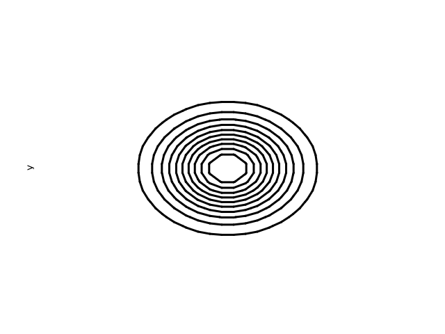
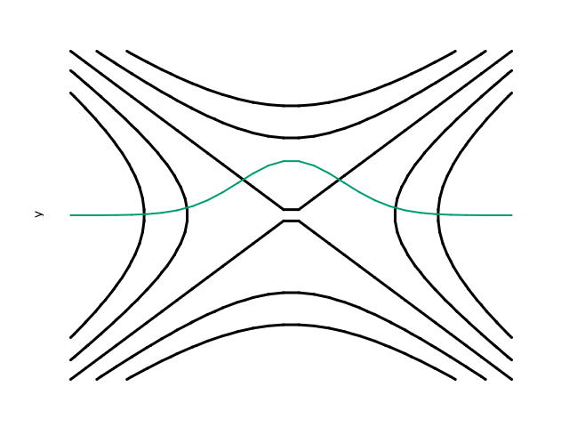

title: Contour Demo
---

# Contour Demo

This example demonstrates contour plotting capabilities, including basic contours, custom levels, and mixing contour plots with line plots.

## Source Code

```fortran
program contour_demo
    !! Contour plotting examples with different functions
    use fortplot
    implicit none

    call gaussian_contours()
    call mixed_contour_line_plot()

contains

    subroutine gaussian_contours()
        real(wp), dimension(30) :: x_grid, y_grid
        real(wp), dimension(30,30) :: z_grid
        type(figure_t) :: fig
        integer :: i, j

        print *, "=== Contour Examples ==="
        
        ! Generate contour grid
        do i = 1, 30
            x_grid(i) = -3.0_wp + (i-1) * 6.0_wp / 29.0_wp
            y_grid(i) = -3.0_wp + (i-1) * 6.0_wp / 29.0_wp
        end do

        ! Gaussian contour
        do i = 1, 30
            do j = 1, 30
                z_grid(i,j) = exp(-(x_grid(i)**2 + y_grid(j)**2))
            end do
        end do

        call fig%initialize(640, 480)
        call fig%set_xlabel("x")
        call fig%set_ylabel("y")
        call fig%set_title("2D Gaussian Function")
        call fig%add_contour(x_grid, y_grid, z_grid, label="exp(-(x²+y²))")
        call fig%savefig('example/fortran/contour_demo/contour_gaussian.png')
        call fig%savefig('example/fortran/contour_demo/contour_gaussian.pdf')
        call fig%savefig('example/fortran/contour_demo/contour_gaussian.txt')
        
        print *, "Created: contour_gaussian.png/pdf/txt"
        
    end subroutine gaussian_contours

    subroutine mixed_contour_line_plot()
        real(wp), dimension(30) :: x_grid, y_grid
        real(wp), dimension(30,30) :: z_grid
        real(wp), dimension(5) :: custom_levels
        type(figure_t) :: fig
        integer :: i, j

        ! Generate grid
        do i = 1, 30
            x_grid(i) = -3.0_wp + (i-1) * 6.0_wp / 29.0_wp
            y_grid(i) = -3.0_wp + (i-1) * 6.0_wp / 29.0_wp
        end do
        
        ! Saddle function with custom levels
        do i = 1, 30
            do j = 1, 30
                z_grid(i,j) = x_grid(i)**2 - y_grid(j)**2
            end do
        end do

        custom_levels = [-4.0_wp, -2.0_wp, 0.0_wp, 2.0_wp, 4.0_wp]
        call fig%initialize(640, 480)
        call fig%set_xlabel("x")
        call fig%set_ylabel("y")
        call fig%set_title("Mixed Plot: Contour + Line")
        call fig%add_contour(x_grid, y_grid, z_grid, levels=custom_levels, label="x²-y²")
        call fig%add_plot(x_grid, exp(-x_grid**2), label="Cross-section at y=0")
        call fig%savefig('example/fortran/contour_demo/mixed_plot.png')
        call fig%savefig('example/fortran/contour_demo/mixed_plot.pdf')
        call fig%savefig('example/fortran/contour_demo/mixed_plot.txt')
        
        print *, "Created: mixed_plot.png/pdf/txt"
        
    end subroutine mixed_contour_line_plot

end program contour_demo
```

## Output

### 2D Gaussian Function



ASCII output:
```
ASCII_OUTPUT_PLACEHOLDER_CONTOUR_GAUSSIAN
```

[Download PDF](../media/examples/contour_gaussian.pdf)

### Mixed Contour and Line Plot



ASCII output:
```
ASCII_OUTPUT_PLACEHOLDER_MIXED_PLOT
```

[Download PDF](../media/examples/mixed_plot.pdf)

## Key Features Demonstrated

- **Basic contours**: Automatic level selection for smooth functions
- **Custom levels**: Specify exact contour levels for precise control
- **Mixed plots**: Combine contours with line plots on the same axes
- **Grid generation**: Creating 2D grids for contour data
- **Mathematical functions**: Gaussian and saddle point examples