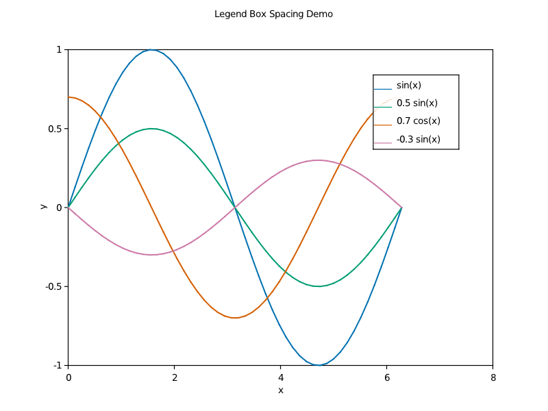
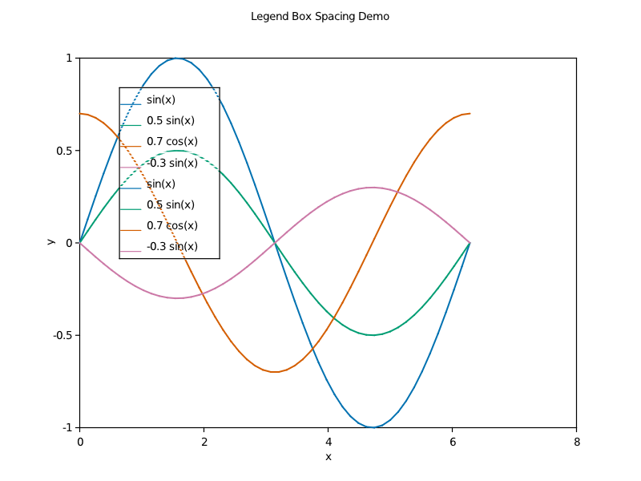

---

# Legend Box Demo

This example shows advanced legend styling with boxes and frames.

## Files

- `legend_box_demo.f90` - Source code
- `legend_box_demo_default.png/pdf/txt` - Default legend box
- `legend_box_demo_upper_left.png/pdf/txt` - Legend box in upper left
- `legend_box_demo_lower_right.png/pdf/txt` - Legend box in lower right

## Running

```bash
make example ARGS="legend_box_demo"
```

## Features Demonstrated

- **Box frames**: Border around legend
- **Background**: Semi-transparent background
- **Padding**: Proper spacing inside box
- **Shadow effects**: Optional drop shadow

## Legend Box Properties

- **Frame**: Black border line
- **Background**: White with alpha transparency
- **Padding**: Automatic based on content
- **Position**: Respects location parameter

## Output

### Default Legend Box


### Upper Left Position

