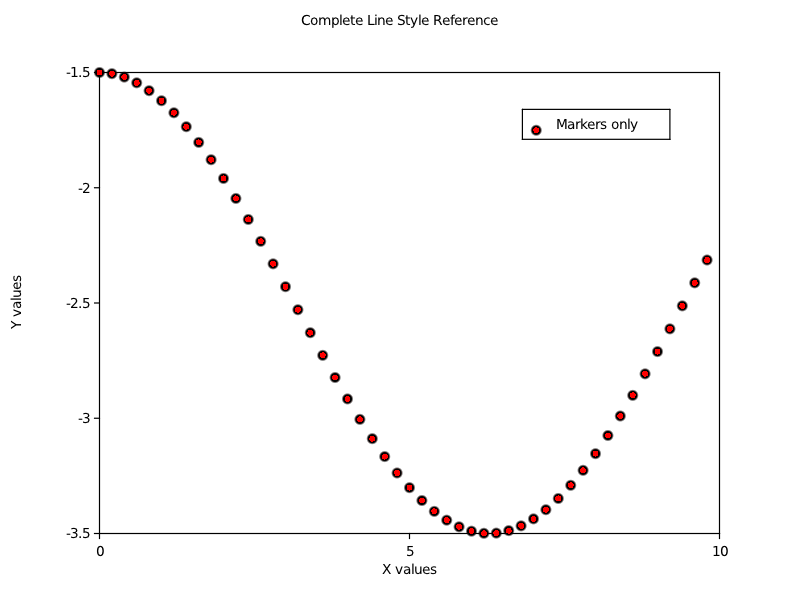

title: Line Styles
---

# Line Styles

This example demonstrates all available line styles in fortplotlib, showing how to customize the appearance of plotted lines.

## Source Code

```fortran
program line_styles
    !! Comprehensive demonstration of line styles in fortplotlib
    !!
    !! This example shows all available line styles:
    !! - Solid lines (-)
    !! - Dashed lines (--)
    !! - Dotted lines (:)
    !! - Dash-dot lines (-.)
    !! - No line (None)
    use fortplot
    implicit none

    real(wp), dimension(50) :: x, y1, y2, y3, y4, y5, y6
    integer :: i

    print *, "=== Line Style Examples ==="

    ! Generate test data with clear separation for visibility
    do i = 1, 50
        x(i) = real(i-1, wp) * 0.2_wp
        y1(i) = sin(x(i)) + 2.5_wp
        y2(i) = cos(x(i)) + 1.5_wp
        y3(i) = sin(x(i) * 2.0_wp) + 0.5_wp
        y4(i) = cos(x(i) * 3.0_wp) - 0.5_wp
        y5(i) = sin(x(i) * 0.5_wp) - 1.5_wp
        y6(i) = cos(x(i) * 0.5_wp) - 2.5_wp
    end do

    ! Comprehensive line style demonstration
    call figure(800, 600)
    call plot(x, y1, label='Solid (-)', linestyle=LINESTYLE_SOLID)
    call plot(x, y2, label='Dashed (--)', linestyle=LINESTYLE_DASHED)
    call plot(x, y3, label='Dotted (:)', linestyle=LINESTYLE_DOTTED)
    call plot(x, y4, label='Dash-dot (-.)', linestyle=LINESTYLE_DASHDOT)
    call plot(x, y5, label='None (invisible)', linestyle=LINESTYLE_NONE)
    call plot(x, y6, label='Markers only', linestyle='o')
    call title('Complete Line Style Reference')
    call xlabel('X values')
    call ylabel('Y values')
    call legend()
    call savefig('example/fortran/line_styles/line_styles.png')
    call savefig('example/fortran/line_styles/line_styles.pdf')
    call savefig('example/fortran/line_styles/line_styles.txt')

    print *, "Line style examples completed!"
    print *, "Files created: line_style_reference.png, line_style_reference.pdf"
    print *, "Note: 'None' linestyle creates invisible lines (no output)"
    print *

end program line_styles
```

## Output



ASCII output:
```
ASCII_OUTPUT_PLACEHOLDER_LINE_STYLES
```

[Download PDF](../media/examples/line_styles.pdf)

## Available Line Styles

| Style Constant | String | Description |
|---------------|--------|-------------|
| `LINESTYLE_SOLID` | `'-'` | Solid line |
| `LINESTYLE_DASHED` | `'--'` | Dashed line |
| `LINESTYLE_DOTTED` | `':'` | Dotted line |
| `LINESTYLE_DASHDOT` | `'-.'` | Alternating dashes and dots |
| `LINESTYLE_NONE` | `'None'` | No line (useful with markers) |

## Key Features

- **Named Constants**: Use predefined constants for better code readability
- **String Shortcuts**: Compatible with matplotlib-style strings
- **Marker Combinations**: Combine with markers for scatter plots
- **Clear Separation**: Data offset vertically for visual clarity